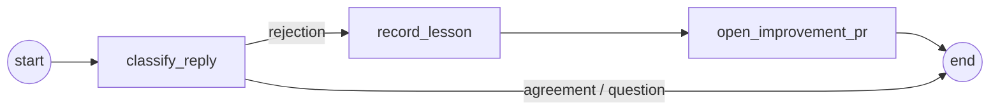

# pr-review-agent

A PR review agent that could plausibly live inside a business — built with **LangGraph** (state & control flow), **LangChain** (models, tools, RAG), and **LangSmith** (tracing & evals).

Give it a diff and it:

- reviews **code style** and **clean code/architecture** against a markdown knowledge base (RAG),
- reviews **security** against the OWASP Top 10, seeded by a **semgrep tool** run,
- **redacts secrets/PII** before any model or trace sees the code,
- sends every draft comment through a **validator subagent** before publishing,
- checks whether **user documentation** went stale,
- **cites official docs** (TypeScript, Next.js, OWASP…) in its comments,
- **teaches instead of policing**: every comment explains _why_ and ends with a 🎓 takeaway — the transferable rule the author keeps after this PR,
- writes suggested code under the vendored **[ponytail](https://github.com/DietrichGebert/ponytail) skill** — the laziest fix that works, never at the cost of validation or security,
- and **learns from rejection**: reply "you're wrong" to a comment and it opens a PR against its own knowledge base recording the lesson.

## Quickstart

```bash
git clone git@github.com:oscardaly/pr-review-agent.git
cd pr-review-agent
make setup          # bun install + creates .env from .env.example
# put an OPENAI_API_KEY (or ANTHROPIC_API_KEY, or AI-Gateway creds) in .env
# put a LANGSMITH_API_KEY in .env to get traces

make demo           # review the bundled sample PR (3 files, several planted issues)
make feedback       # process the bundled "you're wrong" reply → improvement PR proposal
make eval           # run the eval dataset (LangSmith experiment, or locally without a key)
```

**No API key handy?** `make test` runs the entire graph offline — the 28 unit/integration tests exercise every node with a scripted model, and the RAG layer runs on deterministic local embeddings.

The demo prints streamed node-by-node progress, then writes the review to `review-output/pr-42/review.md`:

```
Reviewing PR #42: Add donation export endpoint and CLI log levels

  ◆ ingest                 parsed 3 file(s), redacted 2 secret/PII value(s)
  ◆ security_reviewer      3 draft comment(s)
  ◆ style_reviewer         2 draft comment(s)
  ◆ architecture_reviewer  2 draft comment(s)
  ◆ docs_reviewer          2 document(s) need updating
  ◆ validate_comments      kept 5, dropped 2
  ◆ publish_review         review written to .../review-output/pr-42/review.md
```

Docker: `make docker-build && make docker-demo`.

To point it at another repo/company: `PR_AGENT_USER_DOCS_PATH=<their docs>`, replace `knowledge/*.md` with their guides — or have the agent draft them from the codebase itself: `bun src/cli.ts bootstrap --repo ../some-repo`.

## The graph

```mermaid
flowchart TD
    START((start)) --> ingest["ingest\nparse diff · redact secrets/PII"]
    ingest -- "reviewable changes" --> style["style_reviewer\nRAG: code-style + clean-code"]
    ingest -- "reviewable changes" --> arch["architecture_reviewer\nRAG: clean-architecture"]
    ingest -- "reviewable changes" --> sec["security_reviewer\nsemgrep tool → RAG: OWASP Top 10"]
    ingest -- "reviewable changes" --> docs["docs_reviewer\nreads user docs from env path"]
    ingest -- "empty / delete-only diff" --> publish
    style --> validate["validate_comments\nsubagent cross-examines every draft\n(+ learned lessons from past rejections)"]
    arch --> validate
    sec --> validate
    docs --> validate
    validate --> publish["publish_review\nrender markdown · post via GitHub client"]
    publish --> END((end))
```

**How state moves.** `ingest` parses the raw diff into typed files/hunks with line numbers, redacts secrets and PII in place, then _clears the raw diff from state_ — every later node (and every LangSmith trace of it) works on the redacted view. A conditional edge skips straight to `publish_review` if there's nothing reviewable. The four reviewers run **in parallel** in one superstep, each appending to `draftComments` via a concat reducer — that's the only shared-state merge in the graph, so there's nothing to race. `validate_comments` joins the fan-in (array edge = wait for all), deduplicates, and judges each draft independently; only comments that survive with confidence ≥ threshold reach `publish_review`.

The **feedback graph** is a second, smaller graph:



A rejection gets generalized into a rule of thumb ("don't suggest declarative transforms in documented hot paths"), appended to `knowledge/learned/rejected-comments.md`, and proposed as a PR. The validator reads that file on every review — so a merged lesson immediately changes what the agent will approve. Learning is **PR-gated on purpose**: the agent proposes, humans merge. An agent that silently rewrites its own rules from one grumpy reply is a liability.

## LangSmith

Set `LANGSMITH_TRACING=true` + `LANGSMITH_API_KEY` and every run is traced end-to-end: the graph run (`pr-review #42`, tagged `pr-review-agent`, with PR number/repo/author as metadata), each node, each retrieval, the `semgrep_scan` tool call, and every validator judgement. The eval runner (`make eval`) creates a `pr-review-agent-evals` dataset and records experiments against it.

## Evals

`src/evals/dataset.ts` has six diffs with expected outcomes — SQL injection, hardcoded API key, cryptic naming, `eval()` on user input, a stale-docs flag rename, and (importantly) a **clean refactor where the right answer is to stay quiet**. Three programmatic evaluators score each run:

- `finding_recall` — did the required findings appear (matched by category/title keywords)?
- `clean_pass` — did it avoid raising warnings on the clean diff? (A reviewer that cries wolf gets muted by the team within a week.)
- `docs_impact` — was the documentation-staleness call correct?

With `LANGSMITH_API_KEY` it runs as a LangSmith experiment; without, it prints a local score table. The scoring functions are pure and unit-tested offline.

## Design notes

**Why these five nodes and not one big prompt?** Splitting reviewers by concern gives each one a small, focused context (its own retrieved guidelines, its own doc links), lets them run in parallel, and makes the trace legible — you can see _which_ reviewer produced a bad comment and eval them separately. The validator exists because reviewer nodes are rewarded for finding things; a separate skeptic with the opposite disposition ("drop it unless a senior engineer would act on it") is the cheapest precision lever, and it's also where learned lessons get enforced.

**Tool before model.** The security reviewer runs semgrep first and hands the findings to the model to triage, not the other way round. Deterministic ground truth anchors the LLM: it can't skim past a flagged `eval()`. The bundled scanner is a built-in rule set mirroring semgrep rule IDs (the real binary needs full checked-out files, not diffs); `SemgrepScanner` is a one-function interface, so the real CLI is a drop-in swap. One cute trick: redaction placeholders double as detections — `[REDACTED:api-key]` in a diff _is_ the hardcoded-credential finding.

**Teach, don't police.** Every comment schema requires a `takeaway` — the transferable rule of thumb, generalised beyond this diff — and the reviewer prompts demand the _why_ (principle + consequence) in the body, never a bare instruction. The validator enforces it: a comment that dictates a change without explaining why, or whose takeaway teaches nothing reusable, gets dropped before publishing. A review that leaves the author better at their next PR is worth ten that just gate this one.

**Suggested code follows the [ponytail](https://github.com/DietrichGebert/ponytail) skill** (MIT, vendored at `knowledge/skills/ponytail.md`). When a reviewer writes fix code in a `suggestion`, it climbs ponytail's ladder — does this need to exist, is it already in the diff, does the stdlib cover it, can it be one line — and never trades away validation, error handling, or security. The skill is injected whole into reviewer prompts (it's a disposition, not a lookup — retrieval would defeat its "active every response" contract) and loads from a plain markdown file, so a team can swap in their own code-writing skill without touching TypeScript.

**RAG choices.** The knowledge base is markdown chunked on `##` headings — each chunk is one complete rule, a semantic boundary a token splitter would cut through. Retrieval is topic-filtered cosine similarity over an in-memory store (LangChain v1 dropped the bundled one; ours is ~50 lines against the core `VectorStore` interface). Embeddings are provider-backed when a key exists, and fall back to deterministic hashed bag-of-words so tests, Docker builds, and keyless demos work offline. For a mini KB, keyword-overlap retrieval is honestly fine; the seam to swap in real embeddings (or pgvector) is one factory function.

**Structured output via prompt + Zod parse (with one retry)** instead of provider-native tool calling. Tradeoff made for provider-agnosticism (works identically through the AI Gateway, Anthropic, or a scripted fake in tests). Native tool calling is more robust at scale — it's the first thing I'd change for production, behind the same `invokeStructured` signature.

**Guardrails.** Redaction runs at ingest with conservative patterns (phone matching requires country-code/area-code forms, so numeric literals in code survive). The count is reported in the review header — visible privacy, not silent.

**Everything injected.** The graph takes `{ model, knowledgeBase, github, semgrepScanner, config }` at build time; `src/wiring.ts` is the only place real implementations are chosen. That's why the integration tests can run the _entire_ graph — fan-out, reducers, conditional edges, publishing — with a scripted model that routes canned responses by prompt content (order-independent, so parallel nodes don't flake).

**Could we use the AI Gateway and run on Vercel with Docker?** Gateway: yes, today — it's OpenAI-compatible, so `OPENAI_BASE_URL=https://ai-gateway.vercel.sh/v1` + `PR_AGENT_MODEL=anthropic/claude-sonnet-4.5` just works (that's why the model factory is `ChatOpenAI` + `baseURL` rather than provider SDKs everywhere). Vercel: the graph fits a webhook-triggered function _if_ you enable fluid compute/long timeouts — a full review is one bounded run, a few minutes worst case. But real semgrep wants a checked-out repo and a binary, which pushes toward the Docker image on Cloud Run/Fly/ECS with a thin webhook in front. I'd start there and keep Vercel for the webhook receiver.

## What I'd improve with more time

1. **Real GitHub integration** — the `GithubClient` interface is Octokit-shaped on purpose: post line-anchored review comments, listen for reply webhooks to trigger the feedback graph automatically, open the improvement PR with a real branch.
2. **Native structured output** per provider, behind the existing `invokeStructured` seam.
3. **Real semgrep** against a checked-out worktree, with the diff used to filter findings to changed lines.
4. **LLM-as-judge evaluator** for comment _quality_ (tone, actionability), not just recall/precision of categories — plus a regression suite built from every rejected comment.
5. **Full-file context** — reviewers currently see hunks; fetching surrounding file content would cut false positives (the validator catches many, but prevention beats filtering).
6. **Checkpointing** (LangGraph's persistence) so a failed reviewer node resumes instead of re-running the whole review on big PRs.

## Repo layout

```
src/
  cli.ts, commands/     entry points (review / feedback / bootstrap)
  review/               state, graph, nodes (ingest → reviewers → validate → publish)
  feedback/             self-improvement graph
  rag/                  knowledge base, chunking, vector store, embeddings
  tools/                semgrep tool + rules, GitHub client
  diff/                 unified-diff parser, redaction, prompt formatting
  evals/                dataset, evaluators, local + LangSmith runners
  testing/              scripted chat model (order-independent fake)
knowledge/              the mini knowledge base (style, clean code, architecture, OWASP, doc links, learned lessons)
fixtures/               sample PR, sample reply, sample user docs
```
