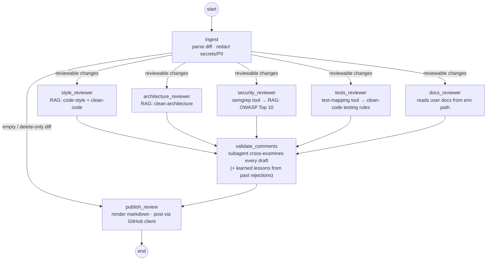
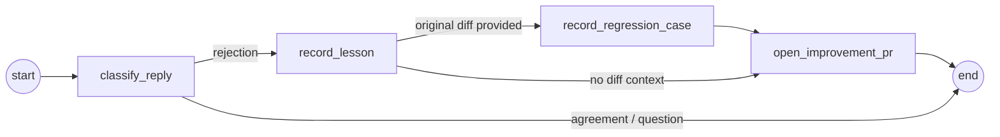

# pr-review-agent

[](https://github.com/oscardaly/pr-review-agent/actions/workflows/ci.yml)

Meet **Leo** 🎨 — a PR review agent that could plausibly live inside a business, built with **LangGraph** (state & control flow), **LangChain** (models, tools, RAG), and **LangSmith** (tracing & evals).

Leo is named after Leonardo da Vinci, because Leo sees everything: style, architecture, security, tests, and documentation in a single pass — and like a good mentor, he'd rather teach you something than gate your merge.

Give Leo a diff and he:

- reviews **style, architecture, security, tests, and docs** with five parallel reviewers over a markdown knowledge base (RAG) — security covers the OWASP Top 10 *and* the OWASP Top 10 for LLM Applications,
- anchors reviewers in **deterministic tools first**: a semgrep scan seeds security, a test-mapping tool seeds the tests reviewer,
- **redacts secrets/PII** before any model or trace sees the code,
- sends every draft through a **validator subagent** — and **teaches instead of policing**: every published comment explains _why_ and ends with a 🎓 takeaway,
- and **learns from rejection**: reply "you're wrong" and he opens a PR against his own knowledge base — recording the lesson *and* freezing the diff as an eval regression case so the mistake can never quietly return.

## Quickstart

Requires [Bun](https://bun.sh) ≥ 1.3 (`curl -fsSL https://bun.sh/install | bash`) — or skip straight to Docker below.

```bash
git clone git@github.com:oscardaly/pr-review-agent.git
cd pr-review-agent
make setup          # bun install + creates .env from .env.example
# put an OPENAI_API_KEY, an ANTHROPIC_API_KEY, or AI-Gateway creds in .env
# (the model defaults to match whichever key you set — override with PR_AGENT_MODEL)
# put a LANGSMITH_API_KEY in .env to get traces

make demo           # review the bundled sample PR (3 files, several planted issues)
make feedback       # process the bundled "you're wrong" reply → improvement PR proposal
make eval           # run the eval dataset (LangSmith experiment, or locally without a LangSmith key — a model key is still needed)
```

**No API key handy?** `make test` runs the entire graph offline — the 48 unit/integration tests exercise every node with a scripted model, and the RAG layer runs on deterministic local embeddings.

The demo prints streamed node-by-node progress, then writes the review to `review-output/pr-42/review.md`:

```
Leo is reviewing PR #42: Add donation export endpoint and CLI log levels

  ◆ ingest                 parsed 3 file(s), redacted 2 secret/PII value(s)
  ◆ security_reviewer      3 draft comment(s)
  ◆ style_reviewer         2 draft comment(s)
  ◆ architecture_reviewer  2 draft comment(s)
  ◆ tests_reviewer         1 draft comment(s)
  ◆ docs_reviewer          2 document(s) need updating
  ◆ validate_comments      kept 5, dropped 3
  ◆ publish_review         review written to .../review-output/pr-42/review.md
```

Docker: `make docker-build && make docker-demo`.

## Run Leo on your PRs

This repo ships `.github/workflows/leo-review.yml`: Leo reviews **every PR automatically** and can be summoned on demand by commenting **`/leo review`**. Reviews post as real GitHub reviews with **line-anchored inline comments** (a fetch-based REST client behind the same `GithubClient` interface as the demo's filesystem stub; anything that can't anchor folds into the review body). Adopting it in any repo = copy the workflow file + set one model-key secret (`OPENAI_API_KEY` or `ANTHROPIC_API_KEY`); optionally a `PR_AGENT_MODEL` variable and `LANGSMITH_API_KEY` secret. Leo's own code and knowledge always run from the default branch — the PR under review is only read as a diff, never executed. And yes: this repo dogfoods it. Leo reviews PRs to Leo.

To point Leo at another repo/company: `PR_AGENT_USER_DOCS_PATH=<their docs>`, replace `knowledge/*.md` with their guides — or have the agent draft them from the codebase itself: `bun src/cli.ts bootstrap --repo ../some-repo`.

## The graph



Ingest redacts, then clears the raw diff from state; a conditional edge skips everything when there's nothing reviewable; the five reviewers run in parallel and fan back into the validator (array edge = wait for all), which judges every draft before anything is published. Full walkthrough: [DESIGN.md — How state moves](DESIGN.md#how-state-moves).

The **feedback graph** is a second, smaller graph:



A rejection becomes a generalized lesson *and* an eval regression case, both shipped in one human-mergeable PR — the agent proposes, humans merge. Full story: [DESIGN.md — How Leo learns](DESIGN.md#how-leo-learns).

## LangSmith

Set `LANGSMITH_TRACING=true` + `LANGSMITH_API_KEY` and every run is traced end-to-end: the graph run (`pr-review #42`, tagged, with PR number/repo/author as metadata), each node, each retrieval (via `asRetriever`), each tool call, and every validator judgement. The feedback command attaches human verdicts to the original review run as LangSmith feedback. `make eval` maintains a `pr-review-agent-evals` dataset (idempotent sync — regression cases keep appending) and records experiments stamped with `{ model, commit }` for before/after comparison.

## Evals

`src/evals/dataset.ts` has six curated diffs with expected outcomes — SQL injection, hardcoded API key, cryptic naming, `eval()` on user input, a stale-docs flag rename, and (importantly) a **clean refactor where the right answer is to stay quiet**. The dataset also **grows itself**: every rejection processed by the feedback graph adds a regression case. Four programmatic evaluators score each run:

- `finding_recall` — did the required findings appear?
- `clean_pass` — did it avoid raising warnings on the clean diff? (A reviewer that cries wolf gets muted within a week.)
- `docs_impact` — was the documentation-staleness call correct?
- `regression_pass` — did any previously rejected comment reappear on the diff that earned the lesson?

## Design notes

One sentence each — the full reasoning lives in [DESIGN.md](DESIGN.md).

- **Six specialist nodes, not one big prompt** — small focused contexts, parallel execution, legible traces, and a validator whose disposition opposes the reviewers'.
- **Tool before model** — semgrep and test-mapping produce deterministic ground truth the model must triage; it can't skim past a flagged `eval()`.
- **Teach, don't police** — every comment must carry the *why* and a reusable takeaway, and the validator drops any that don't.
- **The persona is a contract** — Leo's voice lives in one module and is *enforced* by the validator, not hoped for.
- **Skills are markdown dispositions** — ponytail governs suggestion code, review-critic governs validation, threat-modelling governs the security reviewer; all swappable without touching TypeScript.
- **RAG sized to the problem** — heading-chunked rules, topic-filtered retrieval via `asRetriever` (traced), offline hash embeddings as the keyless fallback; pgvector is one factory swap away.
- **Structured output is layered** — native `withStructuredOutput` for real providers, prompt + Zod parse for the test fakes, one seam.
- **Everything injected** — `src/wiring.ts` is the only place real implementations are chosen, which is why the whole graph runs offline in tests and why the real GitHub client was a drop-in.

## What I'd improve with more time

1. **Finish the GitHub loop** — reviews already post inline to real PRs; next is reply webhooks triggering the feedback graph automatically, and improvement PRs on real branches.
2. **Real semgrep** against a checked-out worktree, with the diff used to filter findings to changed lines.
3. **LLM-as-judge evaluator** for comment _quality_ (tone, actionability), complementing the keyword evaluators.
4. **Full-file context** — reviewers see hunks; surrounding file content would cut false positives at the source.
5. **Checkpointing** (LangGraph persistence) so a big review resumes mid-run across process restarts — and unlocks an `interrupt()` approval gate before publishing.
6. **A team dashboard** — review history and precision trends from the eval experiments, as a Next.js front end over a thin API wrapping the graph.

## Repo layout

```
src/
  cli.ts, commands/     entry points (review / feedback / bootstrap)
  review/               state, graph, nodes (ingest → reviewers → validate → publish)
  feedback/             self-improvement graph
  rag/                  knowledge base, chunking, vector store, embeddings
  tools/                semgrep + test-mapping tools, GitHub clients (filesystem + REST)
  diff/                 unified-diff parser, redaction, prompt formatting
  evals/                dataset, regression cases, evaluators, local + LangSmith runners
  testing/              scripted chat model (order-independent fake)
knowledge/              the mini knowledge base (guidelines, skills, doc links, learned lessons)
fixtures/               sample PR, sample reply, sample user docs
.github/workflows/      ci.yml (offline tests) + leo-review.yml (Leo reviews PRs)
```

Licensed [MIT](LICENSE). Full design rationale: [DESIGN.md](DESIGN.md).
